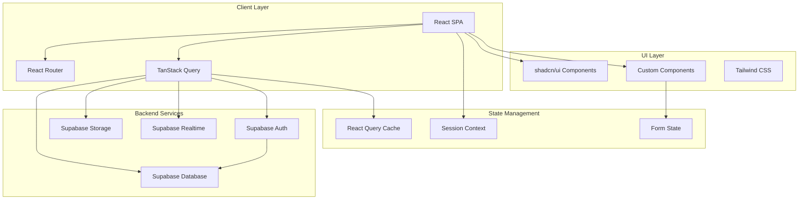
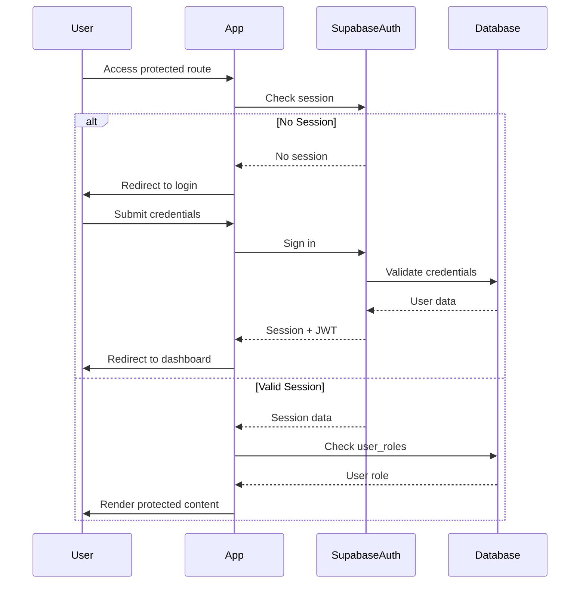

# SavannaFX System Documentation

## Table of Contents
1. [Overview](#overview)
2. [Technology Stack](#technology-stack)
3. [Architecture](#architecture)
4. [Database Schema](#database-schema)
5. [Authentication & Authorization](#authentication--authorization)
6. [Core Features](#core-features)
7. [API Integration](#api-integration)
8. [Routing Structure](#routing-structure)
9. [Component Architecture](#component-architecture)
10. [Deployment & Configuration](#deployment--configuration)
11. [Development Workflow](#development-workflow)

---

## Overview

**SavannaFX** is a comprehensive forex trading platform that provides traders with tools, education, and community features. The platform offers trading signals, market analysis, educational courses, sentiment polling, event management, and various trading calculators.

### Key Capabilities
- **Trading Tools**: Signals, trade analysis, lot size calculator, currency heatmap
- **Education**: Trading courses, one-on-one coaching, academy programs
- **Community**: Sentiment voting, events, collaboration requests
- **Admin Panel**: Complete management system for content, users, and analytics

---

## Technology Stack

### Frontend
- **Framework**: React 18.3.1
- **Language**: TypeScript 5.5.3
- **Build Tool**: Vite 6.3.4
- **Routing**: React Router DOM 6.26.2
- **Styling**: Tailwind CSS 3.4.11
- **UI Components**: shadcn/ui (Radix UI primitives)
- **Animations**: Framer Motion 12.23.26
- **Charts**: Recharts 2.12.7
- **State Management**: TanStack React Query 5.56.2
- **Form Handling**: React Hook Form 7.53.0 + Zod 3.23.8

### Backend & Services
- **Backend as a Service**: Supabase
- **Database**: PostgreSQL (via Supabase)
- **Authentication**: Supabase Auth
- **Storage**: Supabase Storage
- **Real-time**: Supabase Realtime subscriptions

### Development Tools
- **Linting**: ESLint 9.9.0
- **Package Manager**: npm/pnpm
- **Component Tagging**: @dyad-sh/react-vite-component-tagger

---

## Architecture

### High-Level Architecture



### Project Structure

```
SavannaFX/
├── public/                    # Static assets
│   ├── assets/               # Images, logos
│   ├── fonts/                # Custom fonts
│   └── favicon.ico
├── src/
│   ├── components/           # React components
│   │   ├── ui/              # shadcn/ui components (49 components)
│   │   ├── auth/            # Authentication components
│   │   ├── dashboard/       # Dashboard-specific components
│   │   ├── course/          # Course components
│   │   ├── events/          # Event components
│   │   └── forms/           # Form components
│   ├── pages/               # Page components (26 pages)
│   ├── hooks/               # Custom React hooks
│   ├── integrations/        # External service integrations
│   │   └── supabase/        # Supabase client configuration
│   ├── lib/                 # Utility libraries
│   ├── utils/               # Helper functions
│   ├── App.tsx              # Main app component with routing
│   ├── main.tsx             # Application entry point
│   └── globals.css          # Global styles
├── supabase/
│   ├── migrations/          # Database migrations (11 files)
│   ├── email-templates/     # Email templates
│   └── *.md                 # Setup documentation
├── package.json
├── vite.config.ts
├── tailwind.config.ts
└── tsconfig.json
```

---

## Database Schema

### Tables Overview

The database consists of 8 main tables with Row Level Security (RLS) enabled:

#### 1. **user_roles**
Manages user permissions and access levels.

| Column | Type | Description |
|--------|------|-------------|
| `id` | UUID | Primary key |
| `user_id` | UUID | Foreign key to `auth.users` |
| `role` | TEXT | Role: 'admin', 'moderator', 'user' |
| `created_at` | TIMESTAMP | Creation timestamp |
| `updated_at` | TIMESTAMP | Last update timestamp |

**Constraints**: 
- Unique constraint on `user_id`
- Check constraint on role values

**RLS Policies**:
- Users can read their own role
- Admins can read all roles
- Admins can manage all roles

**Helper Functions**:
- `is_admin(user_uuid)`: Returns boolean indicating admin status

---

#### 2. **events**
Stores event information for workshops, webinars, conferences, etc.

| Column | Type | Description |
|--------|------|-------------|
| `id` | UUID | Primary key |
| `title` | TEXT | Event title |
| `organizer` | TEXT | Event organizer name |
| `description` | TEXT | Event description |
| `category` | TEXT | Networking, Workshop, Webinar, Conference, Seminar, Other |
| `type` | TEXT | Physical, Virtual, Hybrid |
| `price_type` | TEXT | Free or Paid |
| `price` | DECIMAL(10,2) | Event price |
| `location` | TEXT | Event location |
| `capacity` | INTEGER | Maximum attendees (default: 100) |
| `cover_image_url` | TEXT | Cover image URL |
| `start_date` | TIMESTAMP | Event start date/time |
| `end_date` | TIMESTAMP | Event end date/time |
| `registration_start_date` | TIMESTAMP | Registration opens |
| `registration_end_date` | TIMESTAMP | Registration closes |
| `status` | TEXT | draft, published, cancelled, completed |
| `is_featured` | BOOLEAN | Featured event flag |
| `created_at` | TIMESTAMP | Creation timestamp |
| `updated_at` | TIMESTAMP | Last update timestamp |
| `created_by` | UUID | Foreign key to `auth.users` |

**Indexes**: category, type, status, start_date, created_at, is_featured

**RLS Policies**:
- Anyone can read published events
- Users can read their own events
- Admins can read all events
- Only admins can manage events

---

#### 3. **event_registrations**
Tracks user registrations for events.

| Column | Type | Description |
|--------|------|-------------|
| `id` | UUID | Primary key |
| `event_id` | UUID | Foreign key to `events` |
| `user_id` | UUID | Foreign key to `auth.users` |
| `registration_status` | TEXT | pending, confirmed, cancelled, attended, no_show |
| `payment_status` | TEXT | pending, completed, failed, refunded |
| `payment_reference` | TEXT | Payment reference number |
| `amount_paid` | DECIMAL(10,2) | Amount paid |
| `registered_at` | TIMESTAMP | Registration timestamp |
| `updated_at` | TIMESTAMP | Last update timestamp |

**Constraints**: Unique constraint on (event_id, user_id)

**RLS Policies**:
- Users can read/insert/update their own registrations
- Admins can read and manage all registrations

**Helper Functions**:
- `get_event_registration_count(event_uuid)`: Returns registration count for an event

---

#### 4. **sentiment_votes**
Community sentiment polling for currency pairs.

| Column | Type | Description |
|--------|------|-------------|
| `id` | UUID | Primary key |
| `user_id` | UUID | Foreign key to `auth.users` |
| `currency_pair` | TEXT | EUR/USD, GBP/USD, USD/JPY, AUD/USD, USD/CAD, EUR/GBP, XAU/USD |
| `sentiment` | TEXT | bullish, bearish, neutral |
| `created_at` | TIMESTAMP | Creation timestamp |
| `updated_at` | TIMESTAMP | Last update timestamp |

**Constraints**: 
- Unique constraint on (user_id, currency_pair) - one vote per user per pair
- Check constraints for valid currency pairs and sentiments

**Indexes**: currency_pair, user_id, created_at

**RLS Policies**:
- Anyone can read sentiment votes
- Users can insert/update/delete their own votes
- Admins can read all votes

---

#### 5. **trade_analyses**
Daily trading pair analyses with technical and fundamental insights.

| Column | Type | Description |
|--------|------|-------------|
| `id` | UUID | Primary key |
| `trading_pair` | TEXT | Trading pair symbol |
| `analysis_date` | DATE | Analysis date |
| `title` | TEXT | Analysis title |
| `content` | TEXT | Full analysis content |
| `summary` | TEXT | Brief summary |
| `technical_analysis` | JSONB | Technical analysis data |
| `fundamental_analysis` | JSONB | Fundamental analysis data |
| `entry_levels` | JSONB | Entry level recommendations |
| `exit_levels` | JSONB | Exit level recommendations |
| `risk_level` | TEXT | low, medium, high |
| `price` | DECIMAL(10,2) | Purchase price |
| `chart_image_url` | TEXT | Chart image URL |
| `created_at` | TIMESTAMP | Creation timestamp |
| `updated_at` | TIMESTAMP | Last update timestamp |
| `created_by` | UUID | Foreign key to `auth.users` |

**Constraints**: Unique constraint on (trading_pair, analysis_date)

**Indexes**: trading_pair, analysis_date, created_at

**RLS Policies**:
- Anyone can read trade analyses
- Service role can manage analyses
- Admins can manage trade analyses

---

#### 6. **trade_analysis_purchases**
Tracks user purchases of trade analyses.

| Column | Type | Description |
|--------|------|-------------|
| `id` | UUID | Primary key |
| `user_id` | UUID | Foreign key to `auth.users` |
| `trade_analysis_id` | UUID | Foreign key to `trade_analyses` |
| `payment_status` | TEXT | pending, completed, failed, refunded |
| `payment_method` | TEXT | Payment method used |
| `payment_reference` | TEXT | Payment reference |
| `amount_paid` | DECIMAL(10,2) | Amount paid |
| `purchased_at` | TIMESTAMP | Purchase timestamp |

**Constraints**: Unique constraint on (user_id, trade_analysis_id)

**Indexes**: user_id, trade_analysis_id, payment_status, purchased_at

**RLS Policies**:
- Users can read/insert/update their own purchases
- Admins can read all purchases

---

#### 7. **enquiries**
User enquiries and support requests.

| Column | Type | Description |
|--------|------|-------------|
| `id` | UUID | Primary key |
| `user_id` | UUID | Foreign key to `auth.users` (nullable) |
| `name` | TEXT | Enquirer name |
| `email` | TEXT | Contact email |
| `phone` | TEXT | Contact phone |
| `enquiry_type` | TEXT | general, trading, signals, course, mentorship, technical, billing, partnership, other |
| `subject` | TEXT | Enquiry subject |
| `message` | TEXT | Enquiry message |
| `status` | TEXT | pending, in_progress, resolved, closed |
| `created_at` | TIMESTAMP | Creation timestamp |
| `updated_at` | TIMESTAMP | Last update timestamp |

**Indexes**: user_id, status, enquiry_type, created_at, email

**RLS Policies**:
- Users can read their own enquiries
- Anyone can insert enquiries (for non-authenticated users)
- Users can update/delete their own enquiries
- Admins can manage all enquiries

---

#### 8. **collaborations**
Partnership and collaboration enquiries.

| Column | Type | Description |
|--------|------|-------------|
| `id` | UUID | Primary key |
| `user_id` | UUID | Foreign key to `auth.users` (nullable) |
| `name` | TEXT | Contact name |
| `email` | TEXT | Contact email |
| `phone` | TEXT | Contact phone |
| `company` | TEXT | Company name |
| `collaboration_type` | TEXT | content, affiliate, education, technology, events, media, influencer, strategic, other |
| `website` | TEXT | Company website |
| `subject` | TEXT | Collaboration subject |
| `message` | TEXT | Collaboration message |
| `status` | TEXT | pending, reviewing, approved, rejected, closed |
| `created_at` | TIMESTAMP | Creation timestamp |
| `updated_at` | TIMESTAMP | Last update timestamp |

**Indexes**: user_id, status, collaboration_type, created_at, email, company

**RLS Policies**:
- Users can read their own collaborations
- Anyone can insert collaborations
- Users can update/delete their own collaborations
- Admins can manage all collaborations

---

### Database Functions

#### Timestamp Management
- `update_updated_at_column()`: Generic trigger function for updating `updated_at` timestamps
- `update_user_roles_updated_at()`: Specific to user_roles table
- `update_events_updated_at()`: Specific to events table
- `update_event_registrations_updated_at()`: Specific to event_registrations table
- Similar functions for other tables

#### Authorization
- `is_admin(user_uuid UUID)`: Returns boolean indicating if user has admin role
  - Uses `SECURITY DEFINER` to bypass RLS
  - Used in RLS policies to grant admin access

#### Event Management
- `get_event_registration_count(event_uuid UUID)`: Returns count of confirmed/pending registrations

#### User Management
- `get_all_users()`: Returns all users with their metadata (admin only)

---

## Authentication & Authorization

### Authentication Flow



### Authentication Components

#### 1. **SupabaseSessionProvider**
- Context provider that manages authentication state
- Provides `session` and `loading` state to all components
- Wraps the entire application in `App.tsx`

#### 2. **RequireAuth**
- Higher-order component for protecting routes
- Checks for valid session before rendering children
- Redirects to login (mobile) or home (desktop) if not authenticated
- Shows loading spinner during authentication check
- Stores intended destination for post-login redirect

#### 3. **RequireAdmin**
- Extends RequireAuth with admin role check
- Uses custom `useAdmin` hook to verify admin status
- Redirects non-admin users to dashboard
- Shows loading state during role verification

### Authorization Levels

| Role | Access Level | Capabilities |
|------|-------------|--------------|
| **User** | Standard | Access to all user features, personal data management |
| **Moderator** | Enhanced | User capabilities + content moderation (future) |
| **Admin** | Full | All capabilities + user management, content management, analytics |

### Row Level Security (RLS)

All tables have RLS enabled with policies that:
- Allow users to read their own data
- Allow users to insert/update their own records
- Grant admins full access via `is_admin()` function
- Some tables allow public read access (e.g., published events, trade analyses)
- Some tables allow anonymous inserts (e.g., enquiries, collaborations)

### Session Management

- **Session Storage**: Supabase handles session tokens in localStorage
- **Session Refresh**: Automatic token refresh handled by Supabase client
- **Session Expiry**: Configurable in Supabase dashboard
- **Post-Login Redirect**: Stored in sessionStorage for seamless UX

---

## Core Features

### 1. Trading Tools

#### **Trade Analysis** (`/dashboard/trade-analysis`)
- Daily trading pair analyses with technical and fundamental insights
- Purchase system for premium analyses
- Chart image support
- Risk level indicators
- Entry/exit level recommendations
- Admin management interface

**Key Components**:
- `TradeAnalysis.tsx`: User-facing analysis viewer
- `AdminTradeAnalyses.tsx`: Admin management interface

**Database Tables**: `trade_analyses`, `trade_analysis_purchases`

---

#### **Trading Signals** (`/dashboard/signals`)
- Premium trading signal delivery
- Real-time signal updates
- Signal history and performance tracking

**Key Components**: `Signals.tsx`

---

#### **Lot Size Calculator** (`/dashboard/lot-size`)
- Position sizing calculator
- Risk management tool
- Account balance and risk percentage inputs
- Stop loss calculation

**Key Components**: `LotSize.tsx`

---

#### **Sentiment Voting** (`/dashboard/sentiment`)
- Community sentiment polling for currency pairs
- Real-time vote aggregation
- Auto-refresh every 10 seconds
- Visual representation with progress bars
- Supported pairs: EUR/USD, GBP/USD, USD/JPY, AUD/USD, USD/CAD, EUR/GBP, XAU/USD

**Key Components**: `Sentiment.tsx`

**Database Tables**: `sentiment_votes`

**Features**:
- One vote per user per currency pair
- Update existing votes
- Real-time percentage calculations
- Last updated timestamp

---

### 2. Education & Mentorship

#### **Course** (`/dashboard/course`)
- "The GOAT Strategy" trading course
- Structured learning modules
- Video content support
- Progress tracking

**Key Components**: 
- `Course.tsx`: Main course page
- `course/` directory: Course-specific components

---

#### **One-on-One Coaching** (`/dashboard/one-on-one`)
- Personal coaching sessions
- Booking system
- Session management

**Key Components**: `OneOnOne.tsx`

---

#### **Academy** (`/dashboard/academy`)
- In-person training programs
- Academy information and enrollment

---

### 3. Events Management

#### **Events System** (`/dashboard/events`)
- Event listing and discovery
- Event registration
- Payment processing for paid events
- Event categories: Networking, Workshop, Webinar, Conference, Seminar
- Event types: Physical, Virtual, Hybrid
- Featured events
- Capacity management

**Key Components**:
- `Events.tsx`: Event listing page
- `EventDetails.tsx`: Individual event page
- `AdminEvents.tsx`: Admin event management

**Database Tables**: `events`, `event_registrations`

**Features**:
- Event creation and management (admin only)
- User registration with payment tracking
- Registration status tracking
- Attendance tracking
- Event cover images via Supabase Storage

---

### 4. Community & Support

#### **Enquiries** (`/dashboard/enquiry`)
- User support request system
- Multiple enquiry types: general, trading, signals, course, mentorship, technical, billing, partnership
- Status tracking: pending, in_progress, resolved, closed
- Anonymous enquiries supported

**Key Components**:
- `Enquiry.tsx`: User enquiry form
- `AdminEnquiries.tsx`: Admin enquiry management

**Database Tables**: `enquiries`

---

#### **Collaborations** (`/dashboard/collaborations`)
- Partnership and collaboration requests
- Collaboration types: content, affiliate, education, technology, events, media, influencer, strategic
- Status workflow: pending → reviewing → approved/rejected → closed
- Company information capture

**Key Components**:
- `Collaborations.tsx`: Collaboration request form
- `AdminCollaborations.tsx`: Admin collaboration management

**Database Tables**: `collaborations`

---

### 5. Admin Panel

#### **Admin Dashboard** (`/admin`)
- Overview of all admin functions
- Quick access to management interfaces
- Analytics and statistics

**Key Components**: `AdminDashboard.tsx`

**Protected Routes**: All `/admin/*` routes require admin role

#### **Admin Features**:
- **User Management** (`/admin/users`): View and manage all users
- **Event Management** (`/admin/events`): Create, edit, publish events
- **Enquiry Management** (`/admin/enquiries`): Review and respond to enquiries
- **Collaboration Management** (`/admin/collaborations`): Review partnership requests
- **Trade Analysis Management** (`/admin/trade-analyses`): Create and manage analyses
- **Purchase Management** (`/admin/purchases`): View all purchase transactions
- **Sentiment Analytics** (`/admin/sentiment`): View sentiment voting statistics

---

### 6. Broker Integration

#### **Trade With Savanna** (`/dashboard/trade-with-savanna`)
- Broker partnership information
- Account opening process
- Trading platform integration

**Key Components**: `TradeWithSavanna.tsx`

---

## API Integration

### Supabase Client Configuration

**Location**: `src/integrations/supabase/client.ts`

```typescript
const SUPABASE_URL = "https://iurstpwtdnlmpvwyhqfn.supabase.co";
const SUPABASE_PUBLISHABLE_KEY = "eyJhbGci...";

const supabase = createClient(SUPABASE_URL, SUPABASE_PUBLISHABLE_KEY);
```

### Common API Patterns

#### Authentication
```typescript
// Sign up
const { data, error } = await supabase.auth.signUp({
  email,
  password,
  options: { data: { first_name, last_name } }
});

// Sign in
const { data, error } = await supabase.auth.signInWithPassword({
  email,
  password
});

// Sign out
await supabase.auth.signOut();

// Reset password
await supabase.auth.resetPasswordForEmail(email);
```

#### Database Queries
```typescript
// Select with filters
const { data, error } = await supabase
  .from('sentiment_votes')
  .select('*')
  .eq('currency_pair', 'EUR/USD');

// Insert
const { data, error } = await supabase
  .from('sentiment_votes')
  .insert({ user_id, currency_pair, sentiment });

// Update
const { data, error } = await supabase
  .from('sentiment_votes')
  .update({ sentiment })
  .eq('id', voteId);

// Delete
const { data, error } = await supabase
  .from('sentiment_votes')
  .delete()
  .eq('id', voteId);
```

#### Storage
```typescript
// Upload file
const { data, error } = await supabase.storage
  .from('event-covers')
  .upload(filePath, file);

// Get public URL
const { data } = supabase.storage
  .from('event-covers')
  .getPublicUrl(filePath);
```

#### Real-time Subscriptions
```typescript
const subscription = supabase
  .channel('sentiment_changes')
  .on('postgres_changes', 
    { event: '*', schema: 'public', table: 'sentiment_votes' },
    (payload) => {
      // Handle changes
    }
  )
  .subscribe();
```

### TanStack Query Integration

The application uses TanStack Query for data fetching and caching:

```typescript
const { data, isLoading, error } = useQuery({
  queryKey: ['sentiment-votes', currencyPair],
  queryFn: async () => {
    const { data, error } = await supabase
      .from('sentiment_votes')
      .select('*')
      .eq('currency_pair', currencyPair);
    
    if (error) throw error;
    return data;
  },
  refetchInterval: 10000, // Auto-refresh every 10 seconds
});
```

---

## Routing Structure

### Public Routes
- `/` - Landing page (Index.tsx)
- `/login` - Login page (Login.tsx)
- `/reset-password` - Password reset page (ResetPassword.tsx)

### Protected User Routes (RequireAuth)
All `/dashboard/*` routes require authentication:

| Route | Component | Description |
|-------|-----------|-------------|
| `/dashboard` | Dashboard.tsx | Main dashboard hub |
| `/dashboard/trade-with-savanna` | TradeWithSavanna.tsx | Broker partnership |
| `/dashboard/signals` | Signals.tsx | Trading signals |
| `/dashboard/course` | CoursePage.tsx | Trading course |
| `/dashboard/one-on-one` | OneOnOne.tsx | Personal coaching |
| `/dashboard/events` | EventsPage.tsx | Event listing |
| `/dashboard/events/:eventId` | EventDetails.tsx | Event details |
| `/dashboard/sentiment` | Sentiment.tsx | Sentiment voting |
| `/dashboard/enquiry` | Enquiry.tsx | Support enquiries |
| `/dashboard/lot-size` | LotSize.tsx | Lot size calculator |
| `/dashboard/collaborations` | Collaborations.tsx | Partnership requests |
| `/dashboard/trade-analysis` | TradeAnalysis.tsx | Trade analyses |
| `/dashboard/:section` | DashboardFeature.tsx | Dynamic feature pages |

### Protected Admin Routes (RequireAdmin)
All `/admin/*` routes require admin role:

| Route | Component | Description |
|-------|-----------|-------------|
| `/admin` | AdminDashboard.tsx | Admin dashboard |
| `/admin/enquiries` | AdminEnquiries.tsx | Manage enquiries |
| `/admin/collaborations` | AdminCollaborations.tsx | Manage collaborations |
| `/admin/trade-analyses` | AdminTradeAnalyses.tsx | Manage trade analyses |
| `/admin/purchases` | AdminPurchases.tsx | View purchases |
| `/admin/sentiment` | AdminSentiment.tsx | Sentiment analytics |
| `/admin/users` | AdminUsers.tsx | User management |
| `/admin/events` | AdminEvents.tsx | Event management |

### Debug Routes
- `/debug-admin` - Admin role debugging (RequireAuth)

### Fallback
- `*` - 404 Not Found page (NotFound.tsx)

---

## Component Architecture

### Component Categories

#### 1. **UI Components** (`src/components/ui/`)
49 shadcn/ui components including:
- Form elements: Button, Input, Select, Checkbox, Radio, Switch, Slider
- Layout: Card, Separator, Scroll Area, Resizable Panels
- Feedback: Toast, Sonner, Alert Dialog, Dialog, Popover
- Navigation: Tabs, Accordion, Navigation Menu, Menubar
- Data Display: Table, Avatar, Badge, Progress
- And more...

#### 2. **Authentication Components** (`src/components/auth/`)
- `SupabaseSessionProvider.tsx`: Session context provider
- `RequireAuth.tsx`: Route protection wrapper
- `RequireAdmin.tsx`: Admin route protection

#### 3. **Dashboard Components** (`src/components/dashboard/`)
- `DashboardLayout.tsx`: Main dashboard layout wrapper
- `DashboardTile.tsx`: Dashboard navigation tiles
- `SavannaCard.tsx`: Custom card component

#### 4. **Landing Page Components**
- `Hero.tsx`: Hero section with 3D galaxy animation
- `SiteHeader.tsx`: Public site header
- `Sidebar.tsx`: Mobile navigation sidebar
- `FeatureSystem.tsx`: Feature showcase
- `ChoiceSection.tsx`: Value proposition section
- `Roadmap.tsx`: Product roadmap
- `BusinessSection.tsx`: Business information
- `FAQ.tsx`: Frequently asked questions
- `PageFooter.tsx`: Site footer

#### 5. **Form Components**
- `LoginForm.tsx`: Login modal form
- `SignupForm.tsx`: Registration modal form
- `ForgotPasswordForm.tsx`: Password reset form

#### 6. **Specialized Components**
- `Galaxy.tsx`: 3D galaxy animation using OGL
- `TypewriterText.tsx`: Typewriter text effect
- Course components (`src/components/course/`)
- Event components (`src/components/events/`)

### Custom Hooks

#### `use-mobile.tsx`
Detects mobile viewport for responsive behavior:
```typescript
const isMobile = useIsMobile();
```

#### `use-admin.tsx`
Checks if current user has admin role:
```typescript
const { isAdmin, loading } = useAdmin();
```

#### `use-toast.ts`
Toast notification management (shadcn/ui):
```typescript
const { toast } = useToast();
toast({ title: "Success", description: "Action completed" });
```

---

## Deployment & Configuration

### Environment Variables

Required environment variables (configured in Supabase integration):
- `SUPABASE_URL`: Supabase project URL
- `SUPABASE_PUBLISHABLE_KEY`: Supabase anon/public key

### Build Configuration

#### Development
```bash
npm run dev
# or
pnpm dev
```
Runs Vite dev server on `http://localhost:5173`

#### Production Build
```bash
npm run build
# or
pnpm build
```
Outputs to `dist/` directory

#### Preview Production Build
```bash
npm run preview
# or
pnpm preview
```

### Supabase Setup

#### 1. Database Migrations
Run migrations in order:
1. `create_user_roles.sql` - User roles and admin function
2. `create_sentiment_votes.sql` - Sentiment voting
3. `create_events.sql` - Events and registrations
4. `create_enquiries.sql` - Enquiry system
5. `create_collaborations.sql` - Collaboration requests
6. `create_trade_analyses.sql` - Trade analysis system
7. `add_chart_image_to_trade_analyses.sql` - Chart image support
8. `create_get_all_users_function.sql` - User management function
9. `enforce_unique_user_email.sql` - Email uniqueness
10. `fix_admin_policies.sql` - Admin policy fixes

#### 2. Storage Buckets
Create storage buckets:
- `event-covers`: Event cover images
  - Public access for reading
  - Authenticated users can upload
  - See `supabase/event_storage_setup.md`

#### 3. Email Templates
Configure email templates in Supabase dashboard:
- See `supabase/EMAIL_SETUP.md` for templates
- Configure SMTP settings for production

#### 4. Authentication Settings
- Enable email/password authentication
- Configure email templates
- Set up password requirements
- Configure session timeout

### Deployment Platforms

#### Vercel (Recommended)
1. Connect GitHub repository
2. Configure build settings:
   - Build Command: `npm run build`
   - Output Directory: `dist`
3. Add environment variables
4. Deploy

#### Netlify
1. Connect GitHub repository
2. Configure build settings:
   - Build Command: `npm run build`
   - Publish Directory: `dist`
3. Add environment variables
4. Deploy

#### Other Platforms
Any platform supporting static site hosting can be used (AWS S3, Cloudflare Pages, etc.)

---

## Development Workflow

### Getting Started

1. **Clone Repository**
```bash
git clone <repository-url>
cd SavannaFX
```

2. **Install Dependencies**
```bash
npm install
# or
pnpm install
```

3. **Configure Supabase**
- Create Supabase project
- Run database migrations
- Set up storage buckets
- Update `src/integrations/supabase/client.ts` with your credentials

4. **Start Development Server**
```bash
npm run dev
```

### Code Style

- **TypeScript**: Strict mode enabled
- **ESLint**: Configured for React and TypeScript
- **Tailwind CSS**: Utility-first styling
- **Component Structure**: Functional components with hooks
- **File Naming**: PascalCase for components, kebab-case for utilities

### Adding New Features

1. **Create Database Tables** (if needed)
   - Add migration file in `supabase/migrations/`
   - Include RLS policies
   - Add indexes for performance

2. **Create Components**
   - Add to appropriate directory in `src/components/`
   - Use TypeScript for type safety
   - Follow existing component patterns

3. **Add Routes** (if needed)
   - Update `src/App.tsx`
   - Add route protection as needed
   - Create page component in `src/pages/`

4. **Update Documentation**
   - Update this file for significant changes
   - Add inline code comments
   - Update README if needed

### Testing

Currently, the project does not have automated tests configured. Consider adding:
- Unit tests with Vitest
- Component tests with React Testing Library
- E2E tests with Playwright or Cypress

### Version Control

- **Main Branch**: Production-ready code
- **Feature Branches**: `feature/feature-name`
- **Bug Fixes**: `fix/bug-description`
- **Commit Messages**: Descriptive and concise

---

## Additional Resources

### Documentation Files
- `README_SENTIMENT.md`: Sentiment voting feature documentation
- `SETUP_SENTIMENT.md`: Sentiment table setup guide
- `supabase/EMAIL_SETUP.md`: Email configuration guide
- `supabase/event_storage_setup.md`: Event storage setup
- `supabase/storage_setup.md`: General storage setup
- `AI_RULES.md`: AI assistant development guidelines

### External Documentation
- [React Documentation](https://react.dev/)
- [TypeScript Documentation](https://www.typescriptlang.org/docs/)
- [Vite Documentation](https://vitejs.dev/)
- [Supabase Documentation](https://supabase.com/docs)
- [Tailwind CSS Documentation](https://tailwindcss.com/docs)
- [shadcn/ui Documentation](https://ui.shadcn.com/)
- [TanStack Query Documentation](https://tanstack.com/query/latest)

---

## Support & Maintenance

### Admin Users
Default admin users (configured in `create_user_roles.sql`):
- User ID: `b7a990b7-4a53-487c-8627-dd6069741bae`
- User ID: `9c9c64d9-63c9-4257-bf40-43b75543f715`

### Common Issues

#### Authentication Issues
- Check Supabase project status
- Verify email confirmation settings
- Check RLS policies

#### Database Issues
- Verify migrations are run in order
- Check RLS policies are enabled
- Verify user roles are set correctly

#### Storage Issues
- Check bucket permissions
- Verify file size limits
- Check CORS settings

### Monitoring
- Supabase Dashboard: Database metrics, API usage
- Browser DevTools: Client-side errors
- Network Tab: API request/response inspection

---

## Changelog

### Version History
- **v0.0.0** - Initial system documentation created

---

## License

[Add license information here]

---

## Contributors

[Add contributor information here]

---

*Last Updated: January 7, 2026*
